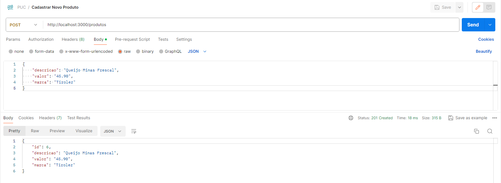
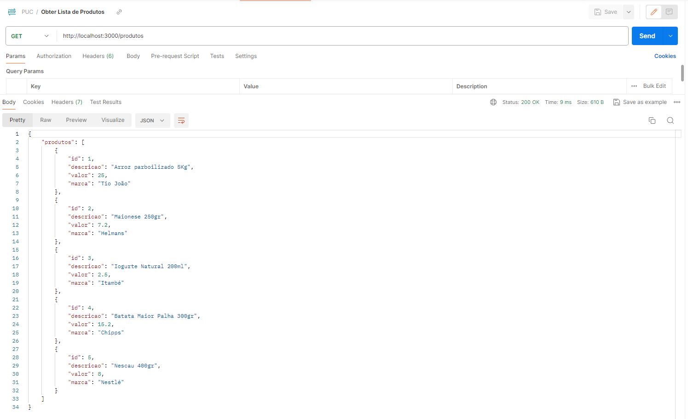
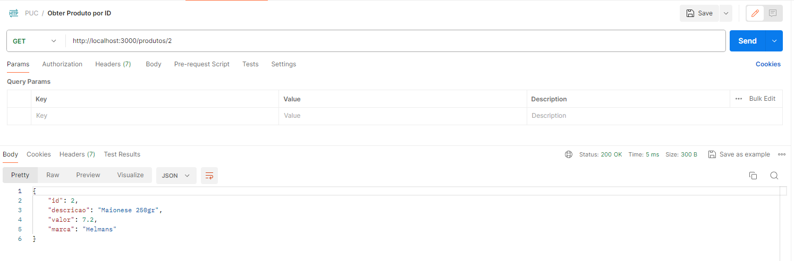
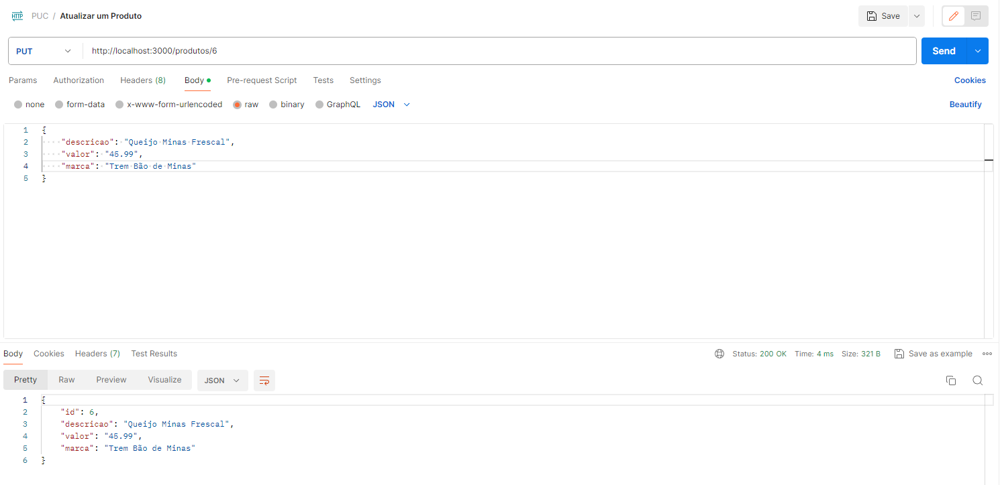
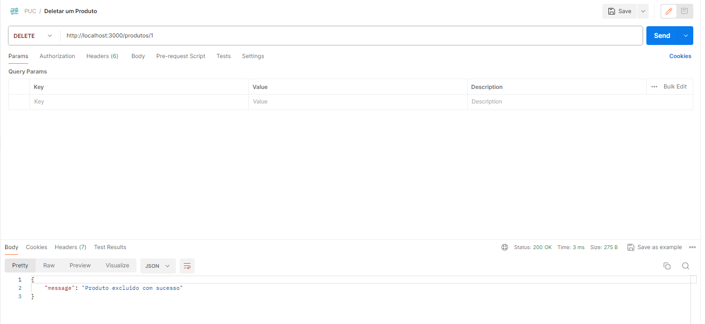
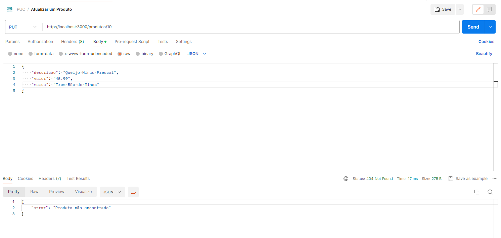
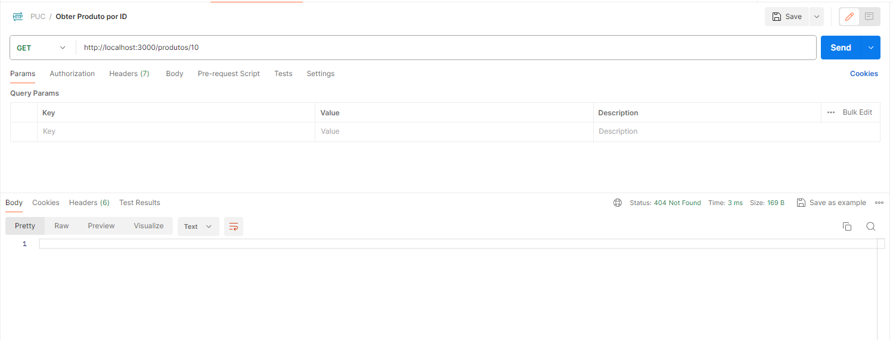
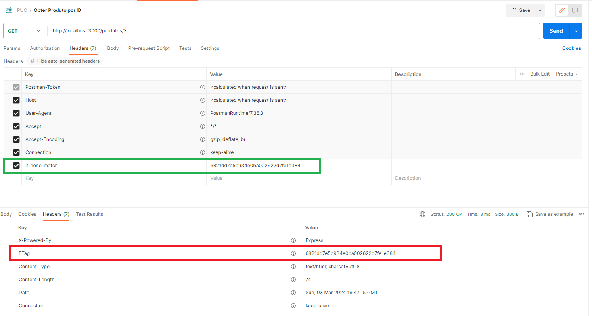

# Trabalho Prático 1 - Implementação de API RESTful com cache

Este projeto é um esboço de API RESTFUL utilizando node.js com Express, e memory-cache.

## Instalação

- Necessário a instalação de node.js;
- Necessário instalar o express: npm install express;
- Necessário instalar o memory-cache: npm install memory-cache;

Após a instalação dos itens acima, execute o comando: npm init para inicializar o servidor node.

Na sequencia, executar o comando: node index.js aguardar a confirmação de que os endpoints estão disponiveis na porta 3000.

A partir deste ponto é possivel executar as operações listadas abaixo.

## Uso da Api

*Incluir um produto*                POST / produtos /
*Obter a lista de produtos*         GET / produtos
*Obter um produto específico*       GET / produtos /:id
*Alterar um produto*                PUT / produtos /:id
*Excluir um produto*                DELETE /produtos/:id

Os testes realizados foram feitos através da POSTMAN:

Incluir um produto:

Obter a lista de produtos:

Obter um produto específico:

Alterar um produto:

Excluir um produto

Os endpoints GET, PUT e DELETE podem retornar 404 - sempre que não for identificado o ID do produto, seja para consultar atualizar ou para exclui-lo.

Tentativa de exclusão de um ID que não existe:

Tentativa de atualizar um ID que não existe:

Tentativa de Obter um ID que não existe:

Para os endpoints GET, existe a possibilidade de usar o cache, pré configurado com 10 minutos.

Onde basta passar no header da requisição o campo: if-none-match com o valor do Hash retornado no campo ETag do Header de Response.

